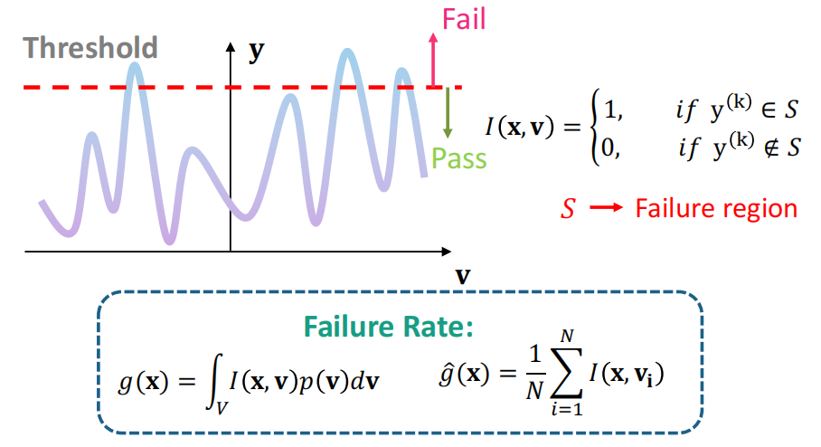
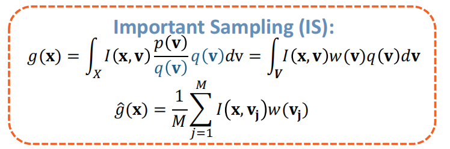
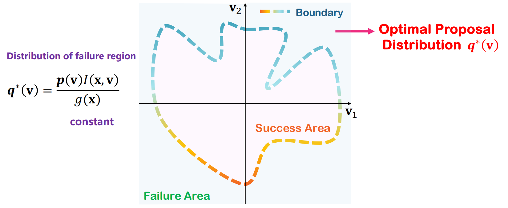

### 1 Problem Defination

    

### 2 Importance Sampling (IS)-based Method

#### 2.1 Problem simplification

#### 2.2 Most critical: Proposal distribution

#### 2.3 Advantages

#### 2.4 Disadvantages

#### 2.5 Classical Papers

### 3 Surrogate Model-based Method

#### 3.1 Most critical:  Train a Surrogate Model as the SPICE Simulator

#### 3.2 Advantages

### 3.3 Disadvantages

### 3.4 Classical Papers
